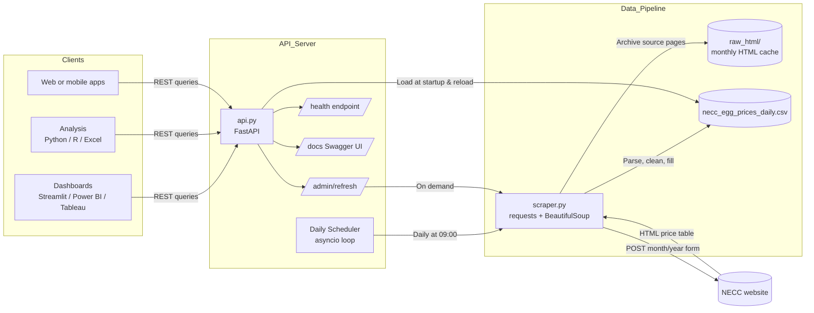

# NECC Egg Price API

A small data pipeline and REST API for daily egg price data from the
[NECC website](https://www.e2necc.com/home/eggprice).

The project has two parts:

- `scraper.py` downloads monthly NECC HTML pages, parses daily prices, fills missing values, and writes a consolidated CSV.
- `api.py` serves the generated CSV through FastAPI for dashboards, analysis, and apps.

## Features

- Scrapes historical and current NECC egg prices.
- Caches monthly source HTML under `raw_html/`.
- Produces a daily CSV with raw and filled prices.
- Fills short missing gaps with linear interpolation, then falls back to previous/next prices.
- Provides filterable REST endpoints by date, market, category, and pagination.
- Includes CORS support for dashboard clients.
- Includes a health endpoint for deployment checks.
- Built-in daily scheduler — automatically refreshes data from the NECC website (no cron needed).
- Manual refresh endpoint (`POST /admin/refresh`) for on-demand updates.

## Project Structure

```text
egg_api/
├── api.py
├── scraper.py
├── requirements.txt
├── cron_setup.txt
├── README.md
├── necc_egg_prices_daily.csv  # generated by scraper.py
├── raw_html/                  # generated source-page cache
└── logs/                      # optional cron logs
```

Generated files such as `necc_egg_prices_daily.csv`, `raw_html/`, `logs/`, and `.venv/` are ignored by Git.

## Setup

Create and activate a virtual environment:

```bash
python3 -m venv .venv
source .venv/bin/activate
```

Install dependencies:

```bash
pip install -r requirements.txt
```

If you prefer not to activate the environment, run commands with `.venv/bin/python` and `.venv/bin/pip`.

## Generate the Dataset

The API runs the scraper automatically on startup if the CSV is missing. You can also run it manually:

```bash
.venv/bin/python scraper.py \
  --start-date 2009-01-01 \
  --end-date 2026-06-11 \
  --output necc_egg_prices_daily.csv
```

For a normal daily refresh, the defaults are enough:

```bash
.venv/bin/python scraper.py --output necc_egg_prices_daily.csv
```

Useful options:

- `--raw-dir raw_html` changes where downloaded monthly HTML is cached.
- `--no-cache` downloads pages again even when cached HTML exists.
- `--interpolation-limit-days 15` controls the maximum missing gap filled by linear interpolation.

The output CSV columns are:

```text
date, year, month, day, market, category, price, price_filled, fill_method
```

## Run the API

Start the server:

```bash
.venv/bin/uvicorn api:app --reload --host 0.0.0.0 --port 8000
```

On first run, if `necc_egg_prices_daily.csv` does not exist, the API will automatically run the scraper to generate the full dataset before serving requests.

The API refreshes data daily at 09:00 by default. Override the schedule with the `REFRESH_TIME` environment variable:

```bash
REFRESH_TIME=06:00 .venv/bin/uvicorn api:app --host 0.0.0.0 --port 8000
```

Open the interactive API docs:

```text
http://localhost:8000/docs
```

## Endpoints

| Method | Endpoint | Description |
| --- | --- | --- |
| GET | `/` | Basic service information |
| GET | `/health` | API health, dataset summary, and refresh schedule |
| GET | `/prices` | Paginated price records with optional filters |
| GET | `/prices/date-range` | Earliest and latest available dates |
| GET | `/prices/markets` | Available market names |
| GET | `/prices/categories` | Available categories |
| GET | `/prices/stats` | Mean, min, max, and count by market/category |
| POST | `/admin/refresh` | Trigger an immediate data refresh from the NECC website |

Example:

```bash
curl "http://localhost:8000/prices?market=Delhi&category=NECC&start_date=2024-01-01&limit=10"
```

Use filled prices:

```bash
curl "http://localhost:8000/prices?market=Delhi&category=NECC&use_filled=true&limit=10"
```

## Automatic Daily Refresh

The API includes a built-in scheduler that runs the scraper once per day at the configured time. No cron job is required.

- **Default schedule:** 09:00 daily
- **Configure:** Set the `REFRESH_TIME` environment variable (format `HH:MM`)
- **Manual trigger:** `POST /admin/refresh`

The scheduler logs refresh activity to stdout. The `/health` endpoint reports `last_refreshed` and `next_refresh` times.

### Alternative: Cron

If you prefer to manage scheduling externally, you can disable the built-in scheduler by not starting uvicorn (not recommended for simple deployments). Alternatively, use cron to run the scraper separately and call the manual refresh endpoint:

```bash
0 9 * * * cd /absolute/path/to/egg_api && /absolute/path/to/egg_api/.venv/bin/python scraper.py --output necc_egg_prices_daily.csv && curl -X POST http://localhost:8000/admin/refresh >> logs/cron.log 2>&1
```

`cron_setup.txt` contains the same example for quick copying.

## Production Notes

For a simple production deployment, install Gunicorn first:

```bash
.venv/bin/pip install gunicorn
```

Then run:

```bash
.venv/bin/gunicorn \
  -k uvicorn.workers.UvicornWorker \
  api:app \
  --bind 0.0.0.0:8000
```

Recommended additions:

- Run behind Nginx or Caddy with HTTPS.
- Manage the API with systemd (the built-in scheduler runs inside the API process).
- Add API key authentication if the service is public.
- Move from CSV to SQLite or PostgreSQL if write/read concurrency becomes important.

## License

MIT License

## Acknowledgements

Data is sourced from the National Egg Coordination Committee website:

https://www.e2necc.com/home/eggprice

## Architecture Diagram


